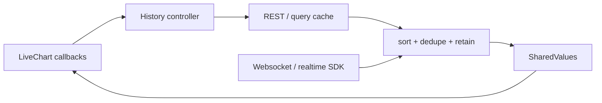

<Warning>
  **Experimental.** The `timeScroll`, `zoom`, `onVisibleRangeChange`, and `onReachStart` APIs may
  still change. The data-ownership pattern in this guide is intentionally transport-agnostic.
</Warning>

LiveChart does not open HTTP or websocket connections. It tells your data layer **what is visible**
and **when older history is needed**; your app fetches or subscribes with its existing client, then
writes sorted rows into Reanimated `SharedValue`s.



This is similar to a TradingView-style `getBars` / `subscribeBars` datafeed, but the adapter belongs
to your application. LiveChart stays compatible with `fetch`, TanStack Query, Apollo, generated
SDKs, NATS, or any other transport.

<Note>
  **Runnable example:**
  [`app/demo/loading-data-on-scroll.tsx`](https://github.com/brandtnewlabs/react-native-livechart/blob/main/app/demo/loading-data-on-scroll.tsx)
  uses a simulated paginated API and live subscription. Pan left repeatedly to watch pages prepend.
</Note>

## The two demand callbacks

```tsx
<LiveChart
  data={data}
  value={value}
  timeScroll
  zoom
  onVisibleRangeChange={(range) => {
    visibleRangeRef.current = range;
  }}
  onReachStart={() => {
    void loadOlderHistory();
  }}
/>
```

- `onVisibleRangeChange` reports `{ startSec, endSec, following }` about once per second. Store the
  latest range so the loader knows how much time the next request must cover.
- `onReachStart` fires once when the visible left edge comes within one window-width of the oldest
  retained row. It re-arms after the retained edge moves far enough into the past.

<Tip>
  One fetched page should cover at least one visible window. If your backend can return sparse or
  empty pages, keep following its cursor until the retained edge reaches the requested time. Do not
  fire several page requests concurrently.
</Tip>

## 1. Define an optional app-level adapter

An interface can make several chart screens consistent without making networking part of
LiveChart itself:

```ts
type TimedRow = { time: number };

type HistoryPage<Row extends TimedRow> = {
  rows: Row[];
  /** Cursor for the next, older page. Null means the beginning was reached. */
  nextCursor: string | null;
};

type ChartDataSource<Row extends TimedRow> = {
  getBars(args: {
    symbol: string;
    resolution: string;
    cursor: string | null;
    limit: number;
    signal: AbortSignal;
  }): Promise<HistoryPage<Row>>;

  subscribeBars?(args: {
    symbol: string;
    resolution: string;
    onBar: (row: Row) => void;
  }): () => void;
};
```

Keep cursors opaque. A cursor should encode the older page boundary and query scope; do not derive a
new cursor from the oldest row because sparse time buckets can otherwise make pagination stall.

Here is a minimal `fetch` + `WebSocket` implementation of that interface. Adapt the response fields
at this boundary so every chart row is already numeric and uses unix seconds:

```ts
type PointPayload = {
  bars: Array<{ timeMs: number; price: number }>;
  nextCursor: string | null;
};

const priceSource: ChartDataSource<LiveChartPoint> = {
  async getBars({ symbol, resolution, cursor, limit, signal }) {
    const params = new URLSearchParams({
      symbol,
      resolution,
      limit: String(limit),
    });
    if (cursor !== null) params.set("cursor", cursor);

    const response = await fetch(`https://api.example.com/bars?${params}`, {
      signal,
    });
    if (!response.ok) throw new Error(`History request failed: ${response.status}`);

    const payload = (await response.json()) as PointPayload;
    return {
      rows: payload.bars.map((bar) => ({
        time: bar.timeMs / 1000,
        value: bar.price,
      })),
      nextCursor: payload.nextCursor,
    };
  },

  subscribeBars({ symbol, resolution, onBar }) {
    const socket = new WebSocket(
      `wss://stream.example.com/bars?symbol=${encodeURIComponent(symbol)}` +
        `&resolution=${encodeURIComponent(resolution)}`,
    );
    socket.onmessage = (event) => {
      const bar = JSON.parse(event.data) as { timeMs: number; price: number };
      onBar({ time: bar.timeMs / 1000, value: bar.price });
    };
    return () => socket.close();
  },
};
```

<Tip>
  Keep the adapter instance stable—define it at module scope as above or wrap it in `useMemo`.
  Recreating `source` every render intentionally resets the history controller.
</Tip>

## 2. Normalize, sort, and deduplicate pages

LiveChart expects timestamps in **unix seconds** and rows in ascending order. Page boundaries and a
simultaneous live update can overlap, so deduplicate by timestamp every time a page is merged.

```ts
function mergeByTime<Row extends { time: number }>(
  current: Row[],
  incoming: Row[],
  maxRows = 10_000,
): Row[] {
  const byTime = new Map<number, Row>();

  // Incoming rows win when the REST page corrects an existing timestamp.
  for (const row of current) byTime.set(row.time, row);
  for (const row of incoming) byTime.set(row.time, row);

  return [...byTime.values()]
    .sort((a, b) => a.time - b.time)
    .slice(-maxRows);
}
```

Using `.set(mergedRows)` for a fetched page is appropriate: page loads are infrequent and replacing
the array publishes one coherent snapshot. Use `.modify(...)` for high-frequency live appends so
the growing array is not cloned across the JS/UI boundary every tick.

## 3. Fetch the initial window and older pages

The loader below provides the important production guards:

- one history drain at a time;
- abort and reset when the symbol or resolution changes;
- follow cursors through sparse pages until the requested time is covered;
- publish each successful page immediately, so a later failed page does not discard progress;
- stop when the server is exhausted or the client retention cap prevents the oldest edge moving.

```tsx
import { useCallback, useEffect, useRef, useState } from "react";
import type { LiveChartPoint, VisibleRange } from "react-native-livechart";
import { useSharedValue } from "react-native-reanimated";

const PAGE_SIZE = 500;
const MAX_RETAINED_ROWS = 10_000;
const TIME_WINDOW_SEC = 5 * 60;

function useScrollingPoints(
  source: ChartDataSource<LiveChartPoint>,
  symbol: string,
  resolution: string,
) {
  const data = useSharedValue<LiveChartPoint[]>([]);
  const value = useSharedValue(0);
  const visibleRange = useRef<VisibleRange | null>(null);
  const cursor = useRef<string | null>(null);
  const exhausted = useRef(false);
  const loading = useRef(false);
  const request = useRef<AbortController | null>(null);
  const generation = useRef(0);
  const [historyState, setHistoryState] = useState<
    "loading" | "ready" | "error" | "exhausted"
  >("loading");

  const fetchUntil = useCallback(
    async (targetStartSec: number, reset = false) => {
      if (reset) {
        generation.current += 1;
        request.current?.abort();
        loading.current = false;
        cursor.current = null;
        exhausted.current = false;
        data.set([]);
      }
      if (loading.current || exhausted.current) return;

      loading.current = true;
      setHistoryState("loading");
      const run = generation.current;

      try {
        while (!exhausted.current) {
          const controller = new AbortController();
          request.current = controller;
          const previousCursor = cursor.current;
          const page = await source.getBars({
            symbol,
            resolution,
            cursor: previousCursor,
            limit: PAGE_SIZE,
            signal: controller.signal,
          });
          if (run !== generation.current) return;

          const before = data.get();
          const previousStart = before[0]?.time ?? Number.POSITIVE_INFINITY;
          const merged = mergeByTime(before, page.rows, MAX_RETAINED_ROWS);
          data.set(merged);
          cursor.current = page.nextCursor;

          const latest = merged[merged.length - 1];
          if (latest) value.set(latest.value);

          const retainedStart = merged[0]?.time ?? Number.POSITIVE_INFINITY;
          const cursorStalled =
            page.nextCursor !== null && page.nextCursor === previousCursor;
          const retentionStalled =
            merged.length >= MAX_RETAINED_ROWS && retainedStart >= previousStart;

          if (cursorStalled) throw new Error("History cursor did not advance");
          if (page.nextCursor === null || retentionStalled) {
            exhausted.current = true;
            setHistoryState("exhausted");
            break;
          }
          if (retainedStart <= targetStartSec) {
            setHistoryState("ready");
            break;
          }
        }
      } catch (error) {
        if ((error as Error).name !== "AbortError") setHistoryState("error");
      } finally {
        if (run === generation.current) {
          loading.current = false;
          request.current = null;
        }
      }
    },
    [data, resolution, source, symbol, value],
  );

  useEffect(() => {
    // Seed two visible windows. This gives the user room to pan immediately.
    const kickoff = setTimeout(() => {
      void fetchUntil(Date.now() / 1000 - TIME_WINDOW_SEC * 2, true);
    }, 0);
    return () => {
      clearTimeout(kickoff);
      generation.current += 1;
      request.current?.abort();
    };
  }, [fetchUntil]);

  const loadOlderHistory = useCallback(() => {
    const range = visibleRange.current;
    const retainedStart = data.get()[0]?.time ?? Date.now() / 1000;
    const windowSec = range ? range.endSec - range.startSec : TIME_WINDOW_SEC;
    const targetStart = (range?.startSec ?? retainedStart) - windowSec;
    return fetchUntil(targetStart);
  }, [data, fetchUntil]);

  return {
    data,
    value,
    visibleRange,
    loadOlderHistory,
    historyState,
  };
}
```

Wire the controller directly to the current chart props:

```tsx
function PriceChart({ symbol }: { symbol: string }) {
  const history = useScrollingPoints(priceSource, symbol, "1m");

  return (
    <LiveChart
      data={history.data}
      value={history.value}
      timeWindow={TIME_WINDOW_SEC}
      timeScroll
      zoom
      loading={history.historyState === "loading" && history.data.get().length === 0}
      onVisibleRangeChange={(range) => {
        history.visibleRange.current = range;
      }}
      onReachStart={() => {
        void history.loadOlderHistory();
      }}
    />
  );
}
```

If a page fails while the user remains near the left edge, `onReachStart` will not spin retries—it
is deliberately edge-triggered. Show a retry affordance that calls `loadOlderHistory()` again, or
retry through your query client with its normal backoff policy.

## 4. Subscribe to live line updates

Subscribe after the initial request starts and unsubscribe when the chart identity changes. Replace
an update at the same timestamp; append a newer update; ignore older out-of-order ticks and let the
next REST page reconcile them.

```tsx
useEffect(() => {
  if (!source.subscribeBars) return;

  return source.subscribeBars({
    symbol,
    resolution,
    onBar: (point) => {
      data.modify((rows) => {
        "worklet";
        const last = rows[rows.length - 1];
        if (!last || point.time > last.time) rows.push(point);
        else if (point.time === last.time) rows[rows.length - 1] = point;
        if (rows.length > MAX_RETAINED_ROWS) rows.shift();
        return rows;
      });
      value.set(point.value);
    },
  });
}, [data, resolution, source, symbol, value]);
```

<Note>
  The websocket does not need to be owned by the screen. A shared SDK or connection manager can
  multiplex one socket across charts; the screen only needs a scoped subscribe/unsubscribe method.
</Note>

## Candlestick bars: committed history plus one live bar

For candlesticks, pass closed buckets through `candles` and the currently forming bucket through
`liveCandle`. Do not put the same bucket in both arrays.

```tsx
import { useEffect } from "react";
import {
  LiveChart,
  type CandlePoint,
  type LiveChartPoint,
  type VisibleRange,
} from "react-native-livechart";
import {
  useSharedValue,
  type SharedValue,
} from "react-native-reanimated";

type CandleUpdate = {
  candle: CandlePoint;
  closed: boolean;
};

type CandleChartProps = {
  /** Closed history, populated by the same paging controller shown above. */
  candles: SharedValue<CandlePoint[]>;
  subscribeCandles: (onUpdate: (update: CandleUpdate) => void) => () => void;
  onVisibleRangeChange: (range: VisibleRange) => void;
  loadOlderCandles: () => void;
};

function CandleChart({
  candles,
  subscribeCandles,
  onVisibleRangeChange,
  loadOlderCandles,
}: CandleChartProps) {
  // `data` remains a required core prop but is not drawn in candle mode.
  const lineFallback = useSharedValue<LiveChartPoint[]>([]);
  const liveCandle = useSharedValue<CandlePoint | null>(null);
  const value = useSharedValue(0);

  useEffect(
    () =>
      subscribeCandles((update) => {
        const next = update.candle;
        value.set(next.close);

        if (!update.closed) {
          liveCandle.set(next);
          return;
        }

        candles.modify((rows) => {
          "worklet";
          const last = rows[rows.length - 1];
          if (!last || next.time > last.time) rows.push(next);
          else if (next.time === last.time) rows[rows.length - 1] = next;
          return rows;
        });

        if (liveCandle.get()?.time === next.time) liveCandle.set(null);
      }),
    [candles, liveCandle, subscribeCandles, value],
  );

  return (
    <LiveChart
      data={lineFallback}
      value={value}
      mode="candle"
      candles={candles}
      liveCandle={liveCandle}
      candleWidth={60}
      timeScroll
      zoom
      onVisibleRangeChange={onVisibleRangeChange}
      onReachStart={loadOlderCandles}
    />
  );
}
```

Merge REST candle pages with the same `mergeByTime` helper before calling `candles.set(...)`. On a
bucket rollover, either receive an explicit `closed` update as above or commit the previous
`liveCandle` before installing the new open bucket.

## Using an infinite-query cache

If your SDK already exposes an infinite query, let it own request deduplication, retry, and cache
lifetime. Flatten pages into chronological order and publish them when the cache changes:

```tsx
const query = useInfiniteBars({ symbol, resolution: "1m" });

const rows = useMemo(
  () => mergeByTime([], query.data?.pages.flatMap((page) => page.rows) ?? []),
  [query.data],
);

useEffect(() => {
  data.set(rows);
  const latest = rows[rows.length - 1];
  if (latest) value.set(latest.value);
}, [data, rows, value]);

<LiveChart
  data={data}
  value={value}
  timeScroll
  zoom
  onReachStart={() => {
    if (query.hasNextPage && !query.isFetchingNextPage) {
      void query.fetchNextPage();
    }
  }}
/>
```

Configure the query to **prepend older pages** (or sort after flattening), include symbol,
resolution, and timeframe in its cache key, and remove or expire inactive large histories according
to your app's memory budget.

## Production checklist

- Send and store timestamps in unix seconds; convert millisecond APIs at the boundary.
- Keep committed rows ascending by time and deduplicate page overlaps.
- Scope cursors and cache keys by symbol, resolution, metric, and chart mode.
- Seed about two visible windows, then fetch one additional window per scroll demand.
- Guard against overlapping requests and abort stale chart identities.
- Let retries happen through an explicit demand or visible retry control—not a render loop.
- Set a retention cap and stop backfilling when that cap prevents the oldest edge from moving.
- Keep closed candles separate from the single in-progress `liveCandle`.
- Unsubscribe realtime listeners on unmount or identity change.
- Log page failures, cursor stalls, and retention-cap stops with the chart identity attached.

See [Time-scroll](/guides/time-scroll) for gesture behavior and the
[`LiveChart` API reference](/api-reference/livechart) for the callback contracts.
